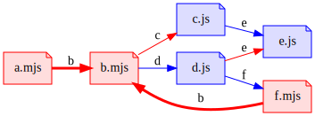
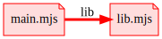
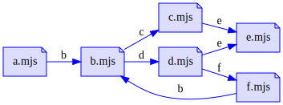
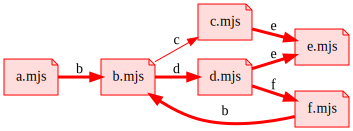

# Dependency graph

A [dependency graph](https://en.wikipedia.org/wiki/Dependency_graph) is a way
to represent the dependencies between various modules.

Each vertex represents a module, each edge represents a "depends on" relation.

## Graphical representation

One of the best things about graphs is that you can render them as an image.
By using colors and labels, you can cram a lot of information in a single
image.

This section describes how to read these graphs.

Each **vertex** (node) represents a module.

The **vertex label** is the id of the module (file name, URI).

The **color of the vertex** represents the module type:
- _blue_: CommonJS module (_Script_ parse goal)
- _red_: ES module (_Module_ parse goal)
- _black_: Any module type

Each **edge** represents a "depends on" relation, from the consumer to the
dependency.

The **edge label** is the corresponding import specifier.

The **color of the edge** represents the import mechanism:
- _blue_: CommonJS `require` function
- _red_: ES `import`. Thick edges are static imports, thin edges are dynamic
  imports.
- _black_: Any import mechanism

 
Here's an example:

## Dependency relations

A useful step to study the dependency graph is to look at its edges
individually. Each edge represents a dependency relation.

A simple model for dependency relations can classify them using:
- The goal symbol of the consumer: `cjs` or `esm`
- The import mechanism: `req`, `si`, `di`
- The goal symbol of the dependency: `cjs` or `esm`

| Notation          | Importer | Mechanism | Exporter | Graphical representation     |
|-------------------|----------|-----------|----------|------------------------------|
| `(cjs, req, cjs)` | CommonJS | `require` | CommonJS |  |
| `(esm, si, esm)`  | ESM      | `import;` | ESM      |   |

 
  

 

### Dependency kind notation

I propose the following notation for the kind of dependency relation.
A kind of dependency is 3-tuple `(consumerGoal, mechanism, dependencyGoal)`.

Example:

### Dependency representation

Arrows represents the "depends on" relation. They are oriented from the
consumer to 

