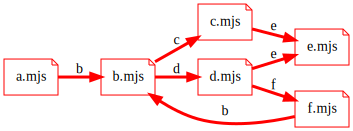
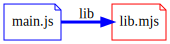

# Dependency graph

Modules let you have isolated components able to expose some of their content
to other modules.
Modules can then import values or bindings from each other.

Here is an example ESM-only dependency graph:

## Dependency relations

A useful step to study the dependency graph is to look at its edges
individually. Each edge represents a dependency relation.

A simple model for dependency relations can classify them using:
- The goal symbol of the consumer: `cjs` or `esm`
- The import mechanism: `req`, `si`, `di`
- The goal symbol of the dependency: `cjs` or `esm`

### Dependency kind notation

I propose the following notation for the kind of dependency relation.
A kind of dependency is 3-tuple `(consumerGoal, mechanism, dependencyGoal)`.

Example:

### Dependency representation

I use 

